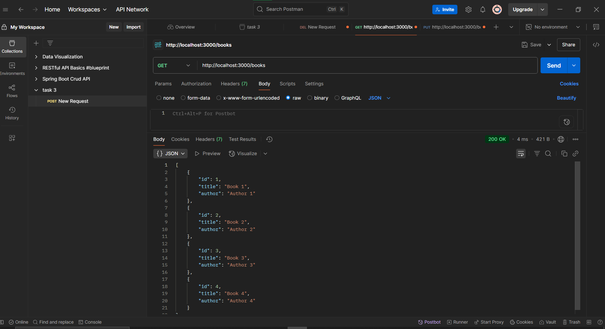
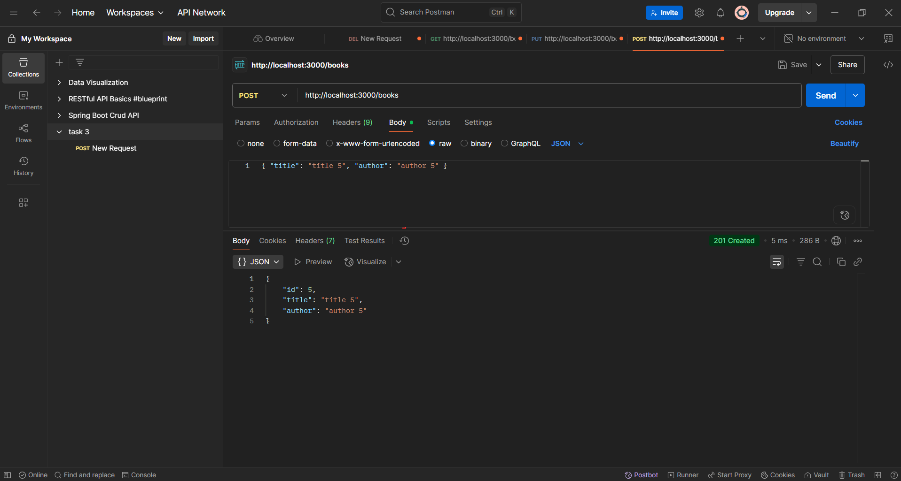
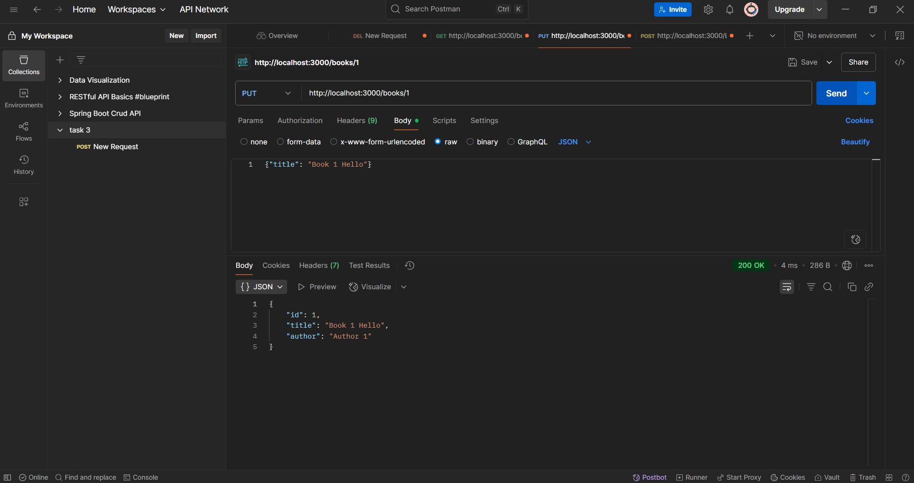
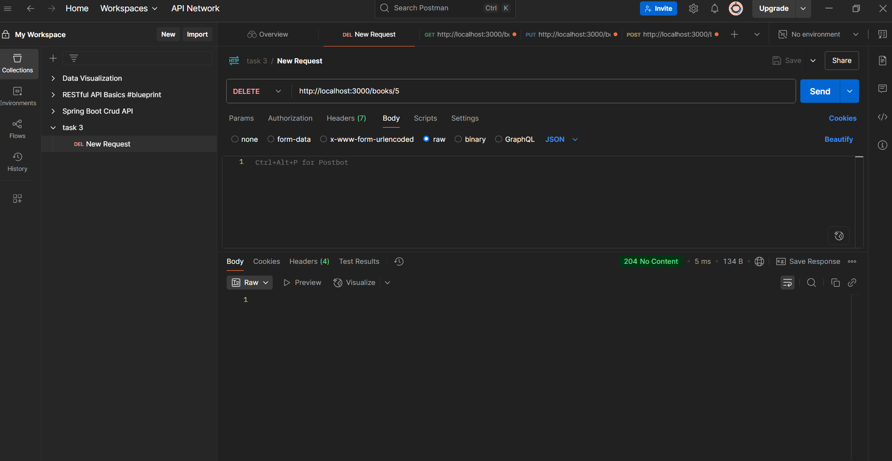

 1. Created a REST API to Manage a List of Books Using Node.js and Express.
 2. created an array called books to store data of books, like id, title and author.
 3. used GET, POST, PUT, DELETE HTTP methods to fetch and manipulate the books data.
 4. Used Postman to test API endpoints
 5. following are the screenshots of the process.
 1. GET
 

 2. POST
 

 3. PUT
 

 4. DELETE
 
